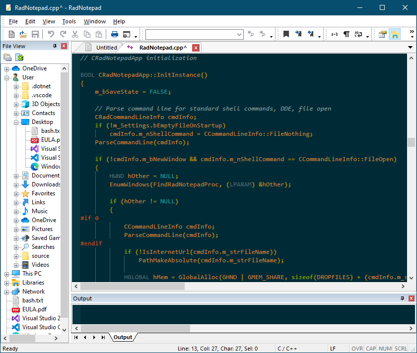

<!--  RadNotepad MFC -->
#  RadNotepad MFC

Text Editor for Source Code. Supports many languages and customizable themes.


[](https://github.com/RadAd/RadNotepadMFC/releases/latest)
[](https://github.com/RadAd/RadNotepadMFC/releases/latest)
[](https://github.com/RadAd/RadNotepadMFC/commits/master)
[](https://ci.appveyor.com/project/RadAd/RadNotepadMFC)



[Scintilla](https://www.scintilla.org/)
-----------
The main text control is a scintilla control.
Everything is included in order to build RadNotepadMFC.
If you want to download the scintilla source:
```bat
msbuild ScintillaPre.vcxproj /t:Update
msbuild LexillaPre.vcxproj /t:Update
```

Build
-----
```bat
msbuild RadNotepad.vcxproj -p:Configuration=Release -p:Platform=x64
```
